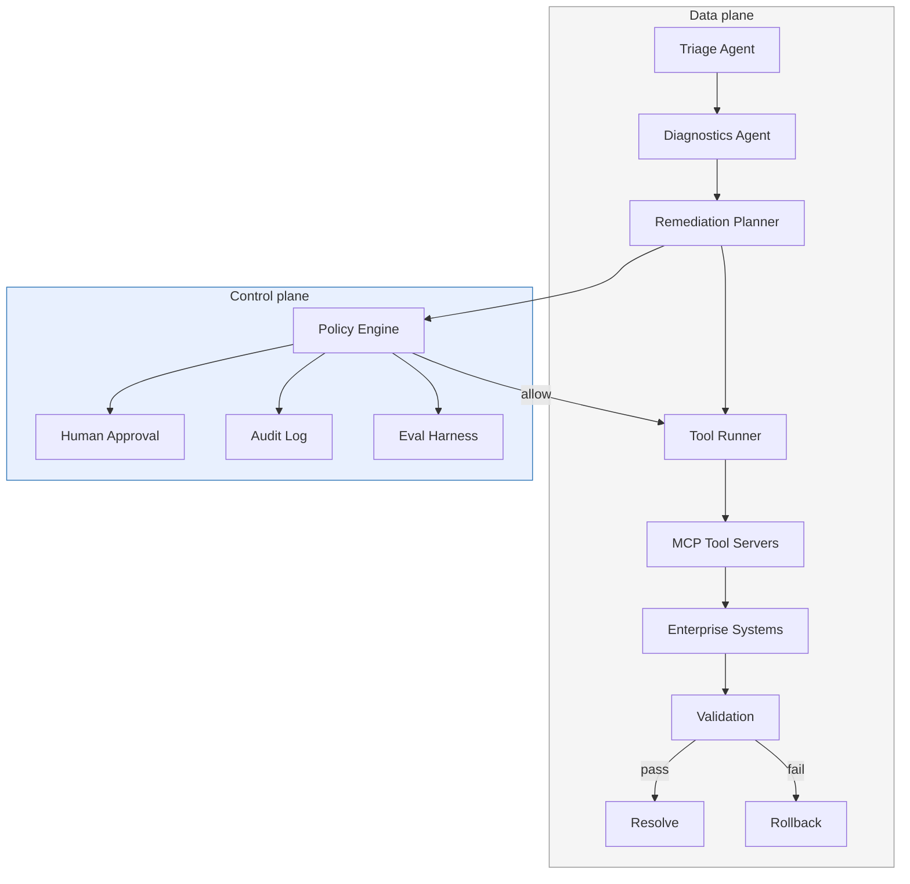

# Governed Agentic AI for ITSM — A Practical Blueprint

[](https://doi.org/10.5281/zenodo.20256777)
[](https://github.com/denis-prilepskiy/governed-agentic-itsm-blueprint/actions/workflows/validate.yml)

## Citation

If you use this blueprint in your work or research, please cite:

> Prilepskiy, D. (2026). *Governed Agentic AI for ITSM — A Practical Blueprint* (v0.2). 
> Zenodo. https://doi.org/10.5281/zenodo.20256777

BibTeX:
```bibtex
@software{prilepskiy_2026_governed_agentic_itsm,
  author       = {Prilepskiy, Denis},
  title        = {Governed Agentic AI for ITSM: A Practical Blueprint},
  year         = {2026},
  publisher    = {Zenodo},
  version      = {v0.2},
  doi          = {10.5281/zenodo.20256777},
  url          = {https://github.com/denis-prilepskiy/governed-agentic-itsm-blueprint}
}

> **Start with the control plane, not the agent.  
> The agent is the easy part.**

**Status: v0.2 — reference blueprint / starter kit.** This is a working collection of schemas, policies, diagrams, and examples. It is not a runnable demo stack or production-ready framework. See [What this repo is / is not](#what-this-repo-is--is-not).

A vendor-neutral reference architecture and ready-to-use engineering artefacts for shipping **governed agentic AI** in IT Service Management — without joining the [40% of agentic AI projects Gartner predicts will be cancelled](https://www.gartner.com/en/newsroom/press-releases/2025-06-25-gartner-predicts-over-40-percent-of-agentic-ai-projects-will-be-canceled-by-end-of-2027) by 2027.

---

## Who this is for

- **ITSM architects and leads** designing agentic automation programmes
- **Platform engineers** building tool contracts and policy gates for AI agents
- **Engineering managers** evaluating governance requirements before enabling autonomous remediation

If you're looking for a vendor-specific implementation guide (ServiceNow, JSM, BMC), this isn't it — but the artefacts here work *with* any of those platforms.

## What this repo is / is not

| This repo IS | This repo IS NOT |
|-------------|-----------------|
| A reference architecture with diagrams | A runnable demo or deployed stack |
| Typed tool contracts with safety metadata | A framework or SDK |
| Executable OPA/Rego policies you can test | A complete policy library for all scenarios |
| Example incidents and evidence bundles | Production-ready configurations |
| A maturity model tying autonomy to controls | A certification or compliance checklist |

## What's inside

| Artefact | Path | Purpose |
|----------|------|---------|
| Reference architecture | [`diagrams/reference-architecture.mermaid`](diagrams/reference-architecture.mermaid) | Agents, control plane, tool layer, evidence store |
| Auto-remediation pipeline | [`diagrams/auto-remediation-pipeline.mermaid`](diagrams/auto-remediation-pipeline.mermaid) | Detect → triage → plan → risk-score → approve → execute → validate → rollback |
| Governance layer stack | [`diagrams/governance-layers.mermaid`](diagrams/governance-layers.mermaid) | ISO 42001 → NIST AI RMF → EU AI Act → runtime enforcement |
| Workflow declaration | [`examples/workflow.yaml`](examples/workflow.yaml) | Autonomy boundaries, guardrails, evidence requirements |
| Tool contracts (8) | [`schemas/tool-*.json`](schemas/) | Typed schemas with safety metadata for restart, certificate renewal, drain, rollback, validation, notification, change record |
| Governance schemas (3) | [`schemas/*-schema.json`](schemas/) | Evidence bundle, policy decision, validation result |
| Tool contract template | [`schemas/tool-schema-template.json`](schemas/tool-schema-template.json) | Starting point for your own tool contracts |
| OPA/Rego policies (8) | [`policies/`](policies/) | Main guardrails + 7 focused modules: prohibited tools, risk, blast radius, dry-run, change window, environment, budgets |
| Change risk prompt | [`examples/change-risk-prompt.md`](examples/change-risk-prompt.md) | Structured prompt template for LLM-driven change risk assessment |
| Example evidence bundle | [`examples/evidence/`](examples/evidence/) | Complete evidence package for a cert-renewal auto-remediation |
| Test incidents (3) | [`examples/test-incidents/`](examples/test-incidents/) | Low, medium, high-risk scenarios for policy testing |
| Maturity model | [`MATURITY.md`](MATURITY.md) | L0–L4 progression from manual ITSM to governed autonomy, with repo artefact mapping |
| CI validation | [`.github/workflows/validate.yml`](.github/workflows/validate.yml) | JSON/YAML/Rego syntax, workflow schema, evidence structure, and semantic decision assertions |

## Architecture overview



Full Mermaid diagrams with complete detail are in [`diagrams/`](diagrams/). GitHub renders `.mermaid` files natively.

## Quick start

### 1. Review the workflow declaration

[`examples/workflow.yaml`](examples/workflow.yaml) defines autonomy boundaries for a starter scope (certificate expiry, service restart, DNS misconfiguration). Adapt `scope.services` and `scope.allowed_categories` to your environment.

### 2. Define your tool contracts

Use [`schemas/tool-restart-service.json`](schemas/tool-restart-service.json) as a template. For each tool your agents can invoke:

- Define typed `input_schema` and `output_schema`
- Add `safety` metadata: `idempotent`, `supports_dry_run`, `max_calls_per_incident`, `rollback_tool`
- Set `dry_run: true` as the default

The repo includes 8 tool contracts covering the most common ITSM operations. Use [`schemas/tool-schema-template.json`](schemas/tool-schema-template.json) to add your own.

### 3. Test policies against sample incidents

```bash
# Install OPA (https://www.openpolicyagent.org/docs/latest/#running-opa)
# macOS:
brew install opa
# Linux:
curl -L -o opa https://openpolicyagent.org/downloads/v1.4.2/opa_linux_amd64_static
chmod 755 opa && sudo mv opa /usr/local/bin/

# Test: low-risk incident (should auto-approve)
opa eval \
  --data policies/ \
  --input examples/test-incidents/low-risk-cert-expiry.json \
  "data.itsm.guardrails.decision"

# Test: medium-risk incident (should require approval)
opa eval \
  --data policies/ \
  --input examples/test-incidents/medium-risk-multi-service.json \
  "data.itsm.guardrails.decision"

# Test: high-risk incident (should require approval — contains "rollback_deployment" tool)
opa eval \
  --data policies/ \
  --input examples/test-incidents/high-risk-deploy.json \
  "data.itsm.guardrails.decision"
```

### 4. Calibrate thresholds with offline replay

Before enabling execution in production:

1. Collect 2–4 weeks of historical incidents for your target categories
2. Run each through the policy engine with the artefacts in this repo
3. Measure: approval rate, false-approval rate, missed-automation rate
4. Adjust `risk_score` thresholds and allowlists based on the data

### 5. Instrument with OpenTelemetry

Propagate `traceparent` through every tool call (the tool contracts include a `traceparent` field for this). Emit stage-level metrics: `triage_duration`, `policy_decision`, `tool_execution_time`, `validation_result`, `rollback_count`.

## Policy pack

The `policies/` directory contains a main guardrails policy and 7 focused modules:

| Module | File | What it enforces |
|--------|------|-----------------|
| **Main guardrails** | `guardrails.rego` | Primary decision policy; aggregates violations from all modules when loaded with `--data policies/`; includes fallback logic for standalone use |
| Prohibited tools | `deny_prohibited_tools.rego` | Hard-block on `delete_data`, `disable_audit`, `mass_restart` |
| Risk threshold | `require_approval_by_risk.rego` | Approval if `risk_score >= 0.60` |
| Blast radius | `require_approval_by_blast_radius.rego` | Approval if `services_affected > 1` |
| Dry-run enforcement | `enforce_dry_run.rego` | Verify dry-run precedes live execution |
| Change window | `enforce_change_window.rego` | Block/escalate outside allowed windows |
| Environment exclusions | `enforce_environment_exclusions.rego` | Hard-block on excluded environments |
| Tool call budget | `enforce_tool_call_budget.rego` | Cap tool calls, actions, and runtime per incident |

## Governance mapping

| Framework | What it gives you | Where it shows up in this repo |
|-----------|-------------------|-------------------------------|
| **ISO/IEC 42001** | AI management system: roles, lifecycle, continual improvement | Workflow declaration (lifecycle), evidence bundles (documentation) |
| **NIST AI RMF** | Risk vocabulary: reliability, safety, transparency, controllability | Policy engine (risk scoring), validation contracts (reliability) |
| **EU AI Act** | Legal requirements: traceability, oversight, penalties | Audit log (traceability), human approval gates (oversight) |

See [`MATURITY.md`](MATURITY.md) for how governance requirements scale with autonomy level.

## Repo structure

```
governed-agentic-itsm-blueprint/
├── README.md
├── MATURITY.md
├── CONTRIBUTING.md
├── SECURITY.md
├── CHANGELOG.md
├── LICENSE                         (Apache 2.0)
├── .gitignore
├── .github/
│   ├── workflows/
│   │   └── validate.yml            (CI: JSON + YAML + Rego validation)
│   └── ISSUE_TEMPLATE/
│       └── adaptation-report.md
├── diagrams/
│   ├── reference-architecture.mermaid
│   ├── auto-remediation-pipeline.mermaid
│   └── governance-layers.mermaid
├── schemas/
│   ├── evidence-bundle.schema.json
│   ├── policy-decision.schema.json
│   ├── validation-result.schema.json
│   ├── tool-restart-service.json
│   ├── tool-restart-service-rollback.json
│   ├── tool-validate-health.json
│   ├── tool-renew-certificate.json
│   ├── tool-drain-connections.json
│   ├── tool-rollback-deployment.json
│   ├── tool-notify-stakeholders.json
│   ├── tool-open-change-record.json
│   └── tool-schema-template.json
├── policies/
│   ├── guardrails.rego
│   ├── deny_prohibited_tools.rego
│   ├── require_approval_by_risk.rego
│   ├── require_approval_by_blast_radius.rego
│   ├── enforce_dry_run.rego
│   ├── enforce_change_window.rego
│   ├── enforce_environment_exclusions.rego
│   └── enforce_tool_call_budget.rego
└── examples/
    ├── workflow.yaml
    ├── change-risk-prompt.md
    ├── evidence/
    │   └── example-evidence-bundle.json
    └── test-incidents/
        ├── low-risk-cert-expiry.json
        ├── medium-risk-multi-service.json
        └── high-risk-deploy.json
```

## Contributing

See [`CONTRIBUTING.md`](CONTRIBUTING.md) for guidelines. The most valuable contributions are [adaptation reports](.github/ISSUE_TEMPLATE/adaptation-report.md) — real-world feedback on what worked and what didn't.

## Related work

- [Model Context Protocol (MCP) Specification](https://modelcontextprotocol.io/specification/2025-03-26)
- [Agent2Agent Protocol (A2A)](https://developers.googleblog.com/en/a2a-a-new-era-of-agent-interoperability/)
- [Open Policy Agent (OPA)](https://www.openpolicyagent.org/docs)
- [OpenTelemetry](https://opentelemetry.io/docs/)
- [ISO/IEC 42001 Explained](https://www.iso.org/home/insights-news/resources/iso-42001-explained-what-it-is.html)
- [NIST AI RMF 1.0](https://www.nist.gov/publications/artificial-intelligence-risk-management-framework-ai-rmf-10)
- [EU AI Act — Entry into force](https://commission.europa.eu/news-and-media/news/ai-act-enters-force-2024-08-01_en)

## License

Apache 2.0 — see [LICENSE](LICENSE).

---

**Author:** Denis Prilepskiy — Agentic AI architect specialising in production-grade multi-agent systems for regulated industries. Senior Enterprise Architect at NTT Data (London). Published in HackerNoon (Top Story) and MIPT Digital (Habr), with IEEE and HBR submissions under review.
HackerNoon @denisp · [LinkedIn](https://www.linkedin.com/in/denisprilepskiy/)
